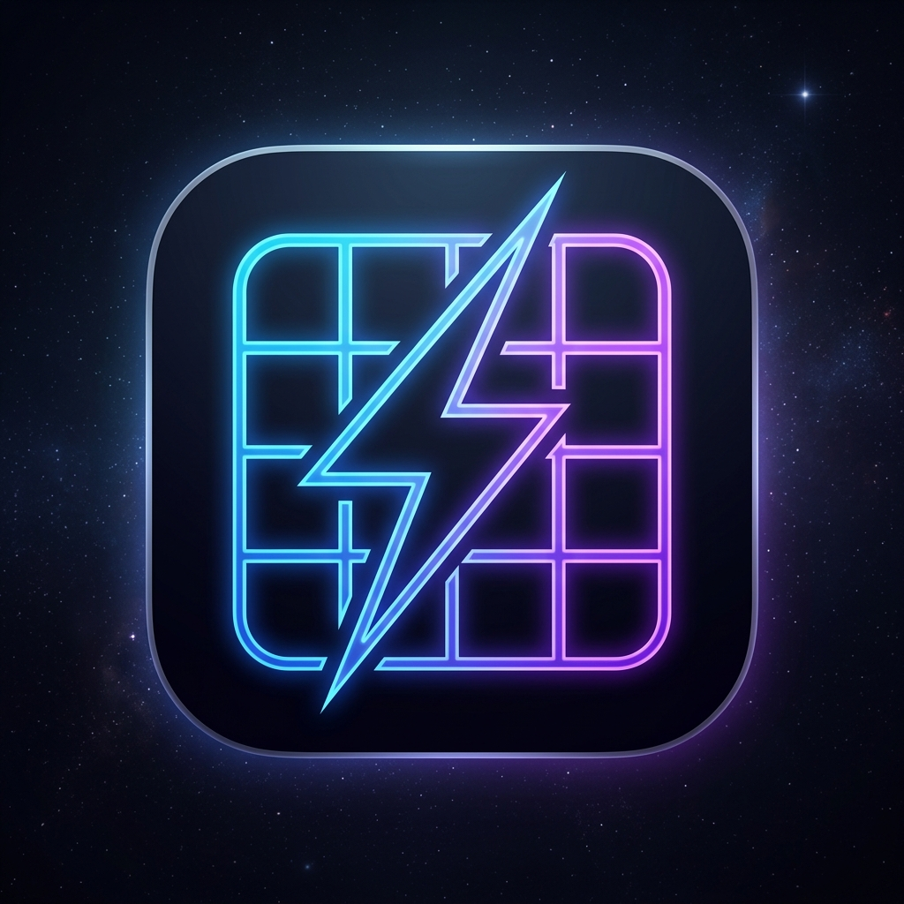

#  Build Daily — Smart Productivity App

<div align="center">


**A premium, all-in-one productivity companion built for Android**

[Features](#-features) • [Tech Stack](#-tech-stack) • [Architecture](#-architecture) • [Installation](#-installation) • [License](#-license)

</div>

---

## ✨ About

**Build Daily** is a premium dark-mode productivity application that helps you take complete control of your day. It combines task scheduling, hydration tracking, a smart book library, budget management, and deep analytics — all in one beautifully designed app.

Built entirely with **Kotlin** and **Jetpack Compose**, it follows a strict **MVVM + Repository** pattern with reactive **StateFlow**-driven UI — delivering a smooth, modern experience.

> 💡 **No account required.** All data is stored securely on-device.

---

## 🌟 Features

### 📅 Smart Task Manager
- **Time-Based Scheduling** — Attach precise time slots to every task
- **Conflict Detection** — Auto-warning for overlapping schedules
- **Expandable Task Cards** — Tap to reveal Edit, Delete, and Repeat actions
- **Color Personalization** — Pick a custom color for each task from the Galactic palette
- **Recurring Tasks** — Set daily, weekly, or custom repeat patterns
- **Category Labels** — Organize tasks by type for analytics

### 💧 Hydration Tracker
- **Daily Water Goal** — Set and track your daily hydration target
- **Daisy-Chain Reminders** — Smart notifications that reschedule based on intake
- **History Dashboard** — View water intake across Daily / Weekly / Monthly / Yearly views
- **WorkManager Integration** — Background reminders persist across reboots
- **Quiet Hours** — Automatically suppresses reminders at night (10 PM – 7 AM)

### 📚 Reading Vault (Book Library)
- **Full Book Metadata** — Title, Author, Genre, Language (English / Hindi / Marathi), Price, Total Pages
- **Reading Progress** — Track pages read with animated progress bars and live percentages
- **4 Status Tabs** — Reading · Want to Read · Done · Favourites
- **Book Cover Images** — Pick and persist cover art from device gallery
- **Advanced Sorting** — Sort by: Recently Added, Author, Language, Category, Price, Pages, Priority, Progress, Title
- **Numeric Input Enforcement** — Pages and Price fields open a number-only keyboard
- **Unified Add / Edit Dialog** — Premium, scrollable dialog with cover picker
- **Delete from Edit** — Remove a book directly from the edit dialog
- **Yearly Reading Goal** — Track progress with animated goal card
- **Library Analytics** — Total books, completed count, pages read stats

### 💰 Buy List & Budget Manager
- **Wishlist Management** — Add items with name, price, and priority
- **Savings Tracker** — Log progress toward each purchase goal
- **Priority System** — Differentiate Must Haves from Wants
- **Affordability Forecast** — Auto-calculate days remaining to reach a goal
- **High-Precision Financials** — Double-based currency tracking

### ⏱️ Pomodoro Focus Timer
- **Classic 25/5 Cycles** — Work and break intervals with notifications
- **Background Service** — Timer continues when the app is minimized
- **Session Tracking** — Count your completed focus sessions

### 🛡️ Security Vault
- **Multiple Lock Methods** — 4-Digit PIN, 6-Digit PIN, Pattern, or Alphanumeric Password
- **Biometric Unlock** — Fingerprint and Face ID integration
- **Glassmorphism Lock Screen** — Premium animated lock UI
- **Secure Onboarding** — Clean setup flow with no forced defaults

### 📊 Analytics & Insights
- **Daily Completion Rate** — See how many tasks you finished today
- **Weekly Trends** — Vico-powered responsive bar charts
- **Category Breakdown** — Performance distribution by task type
- **Streak Tracking** — Build and maintain consistent daily habits
- **History Timeline** — Daily, weekly, monthly, and yearly views

### 🔔 Intelligent Notifications
- **Exact Alarm System** — Precise task reminders using AlarmManager
- **Hydration Reminders** — Smart water intake prompts throughout the day
- **Notification History** — Review all past alerts
- **Android 13+ Compatibility** — Proper runtime permission handling

---

## 🛠️ Tech Stack

| Layer | Technology |
|---|---|
| Language | Kotlin |
| UI Toolkit | Jetpack Compose |
| Design System | Material Design 3 |
| State Management | StateFlow + ViewModel |
| Async | Kotlin Coroutines |
| Navigation | Navigation Compose |
| Image Loading | Coil |
| Charts | Vico (M3) |
| Persistence | SharedPreferences + DataStore |
| Serialization | kotlinx.serialization |
| Date/Time | kotlinx.datetime |
| Background Work | WorkManager |
| Biometrics | AndroidX Biometric |
| Security | AndroidX Security Crypto |

---

## 🏗️ Architecture

Build Daily follows **Clean Architecture** with **MVVM** at each layer:

```
app/
├── data/
│   ├── model/              # Data classes (Book, Task, BuyItem, Hydration...)
│   └── repository/         # Repository pattern — all persistence logic
├── ui/
│   ├── home/               # Today's task timeline
│   ├── addtask/            # Add/Edit task bottom sheet
│   ├── todo/               # Full task list view
│   ├── booklibrary/        # Reading Vault — library + analytics
│   ├── buylist/            # Wishlist & budget tracker
│   ├── hydration/          # Water intake tracker & reminders
│   ├── pomodoro/           # Focus timer with background service
│   ├── stats/              # Analytics dashboard with charts
│   ├── history/            # Activity history across intervals
│   ├── security/           # Lock screen & biometric auth
│   ├── profile/            # Settings & utilities
│   ├── splash/             # Animated splash screen
│   ├── theme/              # Design tokens — colors, typography
│   └── components/         # Shared reusable composables
├── util/                   # Helpers (ImageUtils, DateUtils, Schedulers...)
└── BuildDailyApp.kt        # Root navigation graph & DI wiring
```

**Key Patterns Used:**
- `ViewModel` + `StateFlow` for reactive UI state
- `Repository` abstraction for all data access
- `combine()` for derived list states (filtered + sorted)
- `WorkManager` for reliable background scheduling
- `ImageUtils` for persisting book cover art to internal storage

---

## 📱 Installation

### Prerequisites
- Android Studio Hedgehog or newer
- Android SDK 24+
- Kotlin 2.0+

### Steps

```bash
# 1. Clone the repository
git clone https://github.com/Sandy12bro/Build-Daily.git

# 2. Open in Android Studio
# File → Open → Select the project folder

# 3. Build and run
./gradlew assembleDebug
```

Or install directly using the pre-built APK:

```bash
adb install BuildDaily.apk
```

---

## 📄 License

This project is licensed under the **MIT License** — see the [LICENSE](LICENSE) file for details.

---

<div align="center">

**Built with ❤️ using Kotlin & Jetpack Compose**


[⬆ Back to Top](#-build-daily--smart-productivity-app)

</div>
